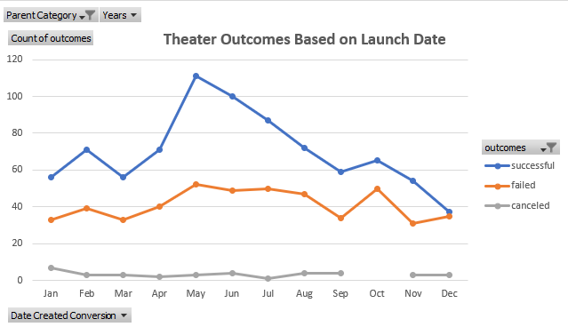
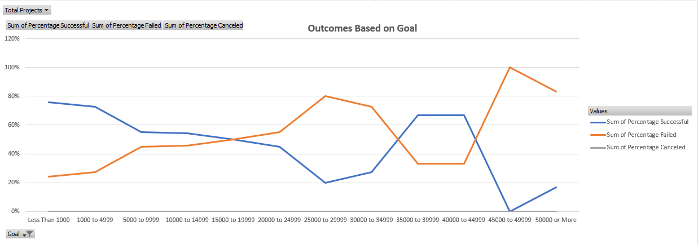

# kickstarter-analysis
Final Project Analysis

## **Kickstart Project overview**

Louise is looking for additional resources in data review to determine if she should launch another
play and if so, what aspects produce the best results for success. 

## **How the Launch date can produce a specific outcome**

Initial Question: What are two conclusions drawn based on the Theater Outcomes based on Launch Date?

Results:
	Our findings reflect a greater success rate in the summer months, ranging from April to August
with the highest success showing 100% or more in both May and June. In the same data set of the Outcomes
based on Launch date we find only one month under a 50% success rate which is December. We can possibly
conclude the summer months provide a more comfortable environment for attending, where as the inclimate 
weather may keep patrons from braving the elements of either driving or walking to see a play.

#### Pivot Chart Data

## **How outcomes are affected by the Goal**

Initial Question: What can be concluded about the Outcomes based on Goals?
   
Results:
	The most glaring piece of information we gained from this analysis was that plays either fail or succeed, we 
did not see any canceled plays. The two highest points of success reflected are two different price points, under 
$5,000 and $35,000 - $45,000. The failure rate was more conclusive showing the lowest percentage of failure under
$5,000 and the highest percentage of failure over $45,000. To help secure a more succcesfull outcome it would be 
beneficial to keep the goal under $5,000. 

#### Pivot Chart Data

## **Data set limitations**

 	We do run into some minor limitations with the data included since we don't have access to the attendees to gain 
 their perspective on why they decided to attend and what would prohibit them from attending. We could take a public
 opinion survey to gain more understanding of the why. 
  
## **Additional table recommendation**

	It could also be valuable to run a comparison of goal amounts, pledged amounts and number of backers based on successful 
or failed outcomes. This overall view could provide more insight into items that could promote success.